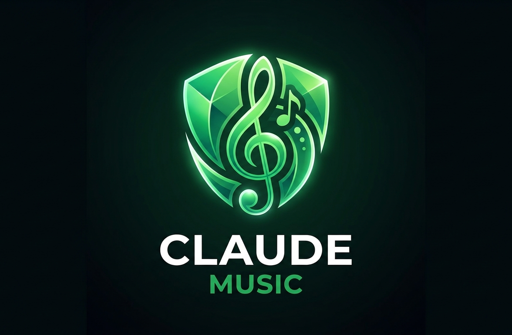

# ClaudeFM



> A desktop music player for Windows — search millions of tracks via Last.fm, download audio from YouTube, and play everything locally with full library management.

---

## Features

- **Search** artists, albums, and tracks using the Last.fm catalog
- **Download** audio directly from YouTube in M4A or MP3
- **Play locally** with seek, volume control, and queue management
- **Lyrics** fetched and synced automatically from LRCLIB after each download
- **Library** organized by artist, album, and playlist — including auto-generated playlists
- **Keyboard shortcuts** for playback control
- **Dark/light theme** support
- **Offline-first** — all data stored locally in SQLite, Last.fm results cached for 30 days

---

## Getting Started

### Prerequisites

- Python 3.11+
- A [Last.fm API key](https://www.last.fm/api/account/create) (free)
- A folder to store your downloaded music

### Installation

```powershell
python -m venv .venv
.venv\Scripts\Activate.ps1
pip install -r requirements.txt
```

### Run

```powershell
python app.py
```

On first launch, open **Settings** to enter your Last.fm API key and choose your music download folder. That's it.

---

## How It Works

1. Search an artist, track, or album in the sidebar — results come from Last.fm
2. Click download on any track — audio is fetched from YouTube and saved locally
3. Lyrics are attached to the file automatically via LRCLIB
4. Play from your library with full queue and playback control
5. Everything is stored locally — no account needed beyond the Last.fm API key

---

## Technical Reference

<details>
<summary>Stack</summary>

| Layer | Tech |
|---|---|
| UI | pywebview 6.2.1 (HTML/CSS/JS SPA) |
| Audio playback | sounddevice 0.5.1 (PortAudio) |
| Metadata | pylast 5.3.0 (Last.fm API) |
| Download | yt-dlp + imageio[ffmpeg] |
| Lyrics | lrcup (LRCLIB API) + mutagen |
| Database | SQLite (WAL mode) |
| Data models | pydantic v2 |
| Backend | Python 3.11+ |

</details>

<details>
<summary>Project structure</summary>

```
app.py                          # Entry point
src/
  models/                       # Pydantic models (Track, Playlist, Artist, Album)
  database/
    database.py                 # SQLite schema + CRUD
    config_manager.py           # Settings key/value store
    file_manager.py             # Library scan (quick + background)
  services/
    lastfm_service.py           # Last.fm search with 30-day cache
    youtube_service.py          # yt-dlp download + filename sanitization
    player_service.py           # sounddevice playback + seek + volume + queue
    lrclib_service.py           # LRCLIB lyrics fetch + mutagen embed
  api/
    api.py                      # pywebview js_api — all methods callable from JS
  utils/
    logger.py                   # Session-based rotating logger
    event_bus.py                # Centralised push events (evaluate_js)
  interface/                    # HTML/CSS/JS SPA (home, library, artists, albums, playlists, settings)
tests/                          # pytest suite (93 tests, 13 modules)
docs/                           # Specs and implementation plans
```

</details>

<details>
<summary>Configuration defaults</summary>

| Key | Default |
|---|---|
| `audio_format` | `m4a` |
| `search_results_limit` | `5` |
| `download_concurrency` | `2` |
| `theme` | `dark` |
| `cache_enabled` | `true` |
| `auto_fetch_lyrics` | `true` |
| `player_volume` | `1.0` |

</details>

<details>
<summary>Running tests</summary>

```powershell
.venv\Scripts\python.exe -m pytest tests/ -v
```

93 tests across 13 modules covering models, database, services, API bridge, and utilities.

</details>
